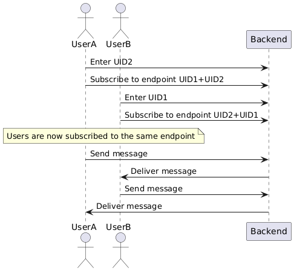

<body>
    <h1>Chatting Application</h1>
    

        This project is a real-time chatting application built using <strong>Spring Boot</strong>, <strong>WebSockets</strong>, <strong>SockJS</strong>, and <strong>STOMP Client</strong> for seamless communication between users.
    

<h2>Features</h2>
    <ul>
        <li>Real-time messaging between users.</li>
        <li>WebSocket-based communication for fast and reliable connections.</li>
        <li>Fallback support using SockJS for browsers that don’t support WebSockets.</li>
        <li>User-friendly and responsive interface.</li>
        <li>Scalable backend using Spring Boot.</li>
    </ul>

<h2>Technologies Used</h2>

<h3>Backend:</h3>
    <ul>
        <li><strong>Spring Boot</strong>: Framework for creating the REST API and WebSocket server.</li>
        <li><strong>WebSockets</strong>: Enabling real-time, full-duplex communication.</li>
        <li><strong>SockJS</strong>: Providing fallback options for WebSocket communication.</li>
        <li><strong>STOMP</strong>: Simple Text-Oriented Messaging Protocol for WebSocket communication.</li>
    </ul>

<h2>System Design</h2>
    

        The application’s communication flow includes a Spring Boot server managing WebSocket connections and clients communicating through the STOMP protocol. SockJS provides fallback support for WebSocket communication.
    

    <h3>Diagram</h3>
    
Below is the system design diagram illustrating the flow of the application:

    

<h2>Project Setup</h2>

<h3>Backend Setup</h3>
    <ol>
        <li>Clone the repository:
            <pre><code>git clone &lt;repository-url&gt;</code></pre>
        </li>
        <li>Navigate to the backend directory:
            <pre><code>cd backend</code></pre>
        </li>
        <li>Build and run the Spring Boot application:
            <pre><code>./mvnw spring-boot:run</code></pre>
        </li>
    </ol>

<h2>How It Works</h2>
    <ol>
        <li><strong>Connection Establishment</strong>:
            
Clients connect to the Spring Boot server using WebSockets or SockJS as a fallback. The STOMP protocol is used for sending and receiving messages.

        </li>
        <li><strong>Messaging</strong>:
            
Users send messages through the WebSocket connection. The backend broadcasts messages to the appropriate recipients.

        </li>
        <li><strong>Fallback Support</strong>:
            
If WebSocket support is unavailable, SockJS enables communication via HTTP-based alternatives.

        </li>
    </ol>

<h2>Contributing</h2>
    
Contributions are welcome! Please fork the repository and create a pull request with your changes.

</body>